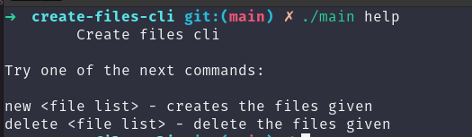

# Create Files Cli

A basic cli to create and delete files



## Commands list:

| Name | Description | Example |
| ---- | ----------- | ------- |
| new | Creates the given list of files | new file1 file2 file3 |
| delete | Deletes the given list of files | delete file1 file2 file3 |
| help | Shows a help message | help |

## Compile && run

### Linux

1. First compile the program
```bash
gcc main.c -o main
```

2. Run the program
```bash
# Create file
./main new file1 file2 file3

# Delete files
./main delete file1 file2 file3
```
